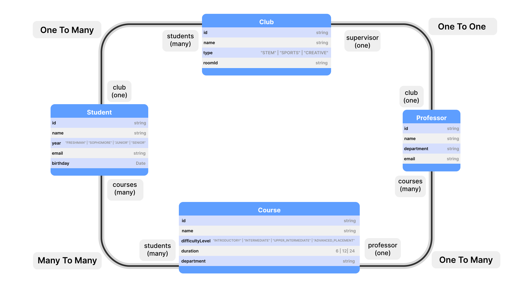

# [Frost](https://frost.sami-mishal.online) Web V1 Example

- use `npm start` to launch the website
- ***Please Don't forget to fill the firebaseConfig object in `src/database/frost.ts`***

## The Data Structure



### Entities

#### Students

- The node path is defined inside the [FrostEntity](https://frost.sami-mishal.online/api/decorators/FrostEntity) decorator
- The node has 4 properties
  - name
  - year
  - email
  - birthday
- A [DateSerializer](https://frost.sami-mishal.online/api/decorators/DateSerializer) is used on the `birthday` property
- The property `excludeExample` is decorated with [Exclude](https://frost.sami-mishal.online/api/decorators/Exclude), so it will not be serialized and inserted in the database.

```typescript
// file='src/database/student.ts'
@FrostEntity({ collectionPath: "/testing/students" })
export class Student extends FrostObject<Student> {

    name?: string;
    year?: "FRESHMAN" | "SOPHOMORE" | "JUNIOR" | "SENIOR";
    email?: string;

    @Exclude()
    excludeExample?: string;

    @DateSerializer<Student>()
    birthday?: Date;
    ...
    ...
    .
    .
}

@FrostNode({
    entity: Student,
})
export class StudentApi extends FrostApi<Student> {}

```

#### Professors

- The node path is defined inside the [FrostEntity](https://frost.sami-mishal.online/api/decorators/FrostEntity) decorator
- The node has 4 properties
  - name
  - department
  - email
  
```typescript
// file='src/database/professor.ts'
@FrostEntity({collectionPath:'/testing/professor'})
export class Professor extends FrostObject<Professor>{

    name?:string;
    department?:string;
    email?:string;

    ...

}

@FrostNode({
    entity: Professor,
})
export class ProfessorApi extends FrostApi<Professor> {}

```

#### Courses

- The node path is defined inside the [FrostEntity](https://frost.sami-mishal.online/api/decorators/FrostEntity) decorator
- The node has 4 properties
  - name
  - department
  - duration: (enum)
  - difficultyLevel: (enum)
  
```typescript
// file='src/database/course.ts'

export enum Duration {
  FULL_YEAR = 24,
  FULL_SEMESTER = 12,
  HALF_SEMESTER = 6,
}

@FrostEntity({collectionPath:'/testing/courses'})
export class Course extends FrostObject<Course> {

    name?:string;
    difficultyLevel?: "INTRODUCTORY" | "INTERMEDIATE" | "UPPER_INTERMEDIATE" | "ADVANCED_PLACEMENT";
    duration?: Duration; // in weeks
    department?: string;

    ...

}

@FrostNode({
    entity: Course,
})
export class CourseApi extends FrostApi<Course> {}
```

#### Clubs

- The node path is defined inside the [FrostEntity](https://frost.sami-mishal.online/api/decorators/FrostEntity) decorator
- The node has 4 properties
  - name
  - roomId
  - type: (enum)

```typescript
// file='src/database/club.ts'
@FrostEntity({collectionPath:'/testing/clubs'})
export class Club extends FrostObject<Club> {

    name?: string;

    type?: "STEM" | "SPORTS" | "CREATIVE";

    roomId?: string;

    ...

}

@FrostNode({
    entity: Club,
})
export class ClubApi extends FrostApi<Club> {}

```
  
### Relations

#### One to One

##### Club Supervisor (Professor <--> Club)

- Each Club has one supervisor and each professor supervises only one club.
- Relation Name: `CLUB_SUPERVISOR` constant. should be passed to the decorator on both sides.
- Relation Type: `RelationTypes.ONE_TO_ONE`. should be passed to the decorator at least on one side.
- `Professor`:
  - `club` property is decorated with the [Relation](https://frost.sami-mishal.online/api/decorators/Relation) decorator.
    - `type: ()=> CLub` is passed to the decorator and it's the same as the type of the property since it's "One to One"
- `Club`:
  - `supervisor` property is decorated with the [Relation](https://frost.sami-mishal.online/api/decorators/Relation) decorator.
    - `type: ()=> Professor` is passed to the decorator and it's the same as the type of the property since it's "One to One"
  

```typescript
import {CLUB_SUPERVISOR} from "./const.ts"

// file='src/database/professor.ts'
@FrostEntity({collectionPath:'/testing/professor'})
export class Professor extends FrostObject<Professor>{

    ...

    @Relation({ name: CLUB_SUPERVISOR, type: () => Club,relation:RelationTypes.ONE_TO_ONE })
    club?: () => Club

    ...

}

// file='src/database/club.ts'
@FrostEntity({collectionPath:'/testing/clubs'})
export class Club extends FrostObject<Club> {

    ...

    @Relation({ name: CLUB_SUPERVISOR, type: () => Professor,relation:RelationTypes.ONE_TO_ONE })
    supervisor?: () => Professor

    ...

}

```

#### One to Many

##### Club Members (Club <--> Student)

- Each Club has multiple students (members) and each student is allowed to participate in one club only
- Relation Name: `CLUB_STUDENTS` constant. should be passed to the decorator on both sides.
- Relation Type: `RelationTypes.ONE_TO_MANY`. should be passed to the decorator at least on one side.
- `Club`: (Main)
  - `students` property is decorated with the [Relation](https://frost.sami-mishal.online/api/decorators/Relation) decorator.
    - `type: ()=> Student` is passed to the decorator while the type of the property is `()=> Student[]` since the `Club` is the main (one) side and the `Student` are the many side.
    - Also, Since the Club is the Main side; then `master: true` should be passed to the relation decorator.
- `Student`: (Secondary)
  - `club` property is decorated with the [Relation](https://frost.sami-mishal.online/api/decorators/Relation) decorator.
    - `type: ()=> Club` is passed to the decorator and the type of the property is also `()=> Club` since the `Student` is the secondary (many) side and the `Club` is main (one) side.
***Tip: `master: true` should be in the Relation decorator that decorates the property with the Array type***

```typescript

// file='src/database/club.ts'

@FrostEntity({collectionPath:'/testing/clubs'})
export class Club extends FrostObject<Club> {

    ...

    @Relation({ name: CLUB_STUDENTS, type: () => Student,relation: RelationTypes.ONE_TO_MANY, master: true })
    students?: () => Student[]

    ...
}

// file='src/database/student.ts'

export class Student extends FrostObject<Student> {
    
    ...

    @Relation({ name: CLUB_STUDENTS, type: () => Club, relation: RelationTypes.ONE_TO_MANY })
    club?: () => Club;

    ..

}

```

##### Professors' Courses  (Professor <--> Course)

- Each Course is taught by one professor but one professor teaches multiple courses.
- Relation Name: `CLUB_STUDENTS` constant. should be passed to the decorator on both sides.
- Relation Type: `RelationTypes.ONE_TO_MANY`. should be passed to the decorator at least on one side.
- `Professor`:(Main)
  - `courses` property is decorated with the [Relation](https://frost.sami-mishal.online/api/decorators/Relation) decorator.
    - `type: ()=> Course` is passed to the decorator while the type of the property is `()=> Course[]` since the `Professor` is the main (one) side and the `Course` is the many side.
    - Also, Since the Club is the Main side; then `master: true` should be passed to the relation decorator.
- `Course`:(Secondary)
  - `professor` property is decorated with the [Relation](https://frost.sami-mishal.online/api/decorators/Relation) decorator.
    - `type: ()=> Professor` is passed to the decorator and the type of the property is also `()=> Professor` since the `Course` is the secondary (many) side and the `Professor` is main (one) side.

***Tip: `master: true` should be in the Relation decorator that decorates the property with the Array type***

```typescript
// file='src/database/professor.ts'
@FrostEntity({collectionPath:'/testing/professor'})
export class Professor extends FrostObject<Professor>{

    ...

    @Relation({ name: PROFESSOR_COURSES , type: () => Course, relation:RelationTypes.ONE_TO_MANY, master:true})
    courses?: () => Course[]

    ...

}
// file='src/database/course.ts'
export class Course extends FrostObject<Course> {

    ...

    @Relation(
      {
        name: PROFESSOR_COURSES,
        type: () => Professor,
        relation: RelationTypes.ONE_TO_MANY
      }
    )
    professor?:() => Professor

    ...

}

```

#### Many to Many

##### Students' Courses (Student <--> Course)

- Each Course is audited by multiple students and each student audits multiple courses
- Relation Name: `STUDENT_COURSES` constant. should be passed to the decorator on both sides.
- Relation Type: `RelationTypes.MANY_TO_MANY`. should be passed to the decorator at least on one side.
- `Student`:
  - `courses` property is decorated with the [Relation](https://frost.sami-mishal.online/api/decorators/Relation) decorator.
    - `type: ()=> Course` is passed to the decorator while the type of the property is `()=> Course[]` since it's "Many to Many"
- `Course`:
  - `students` property is decorated with the [Relation](https://frost.sami-mishal.online/api/decorators/Relation) decorator.
    - `type: ()=> Student` is passed to the decorator while the type of the property is `()=> Student[]` since it's "Many to Many"
  
```typescript
import {STUDENT_COURSES} from './consts.ts'
// file='src/database/student.ts'
export class Student extends FrostObject<Student> {
    ...
    
    @Relation({
        name: STUDENT_COURSES,
        relation: RelationTypes.MANY_TO_MANY,
        type: () => Course,
    })
    courses?: () => Course[];

    ...
}

// file='src/database/course.ts'
export class Course extends FrostObject<Course> {

    ...

    @Relation({ name: STUDENT_COURSES, type: () => Student })
    students?: () => Student[]

    ...

}

```

## Brief Explanation on flow

### Initialization

- The firebase configuration object is passed as the first argument to the [Frost.initialize](https://frost.sami-mishal.online/api/classes/Frost#initialize) function.
- The APIs are passed in a map as the second argument. ***If the keys for the APIs are specified then you can access the APIs by the name you desire***
- The Function Returns a FrostApp Instance containing the APIs instances and the `firebaseApp` instance.
- On `Line 8`: the firebase DB instance is retrieved by passing the `firebaseApp` instance to the [getDatabase()](https://firebase.google.com/docs/reference/js/database#getdatabase) function. this instance will be used in the [update()](https://firebase.google.com/docs/reference/js/database#getdatabase) function in [Mock Data](#mock-data)

```typescript
//file=src/database/frost.ts
export const FrostApp = Frost.initialize(firebaseConfig, {
    CourseApi,
    ClubApi,
    ProfessorApi,
    StudentApi,
})

export const fireDB = getDatabase(FrostApp.firebaseApp)
```

### Rendering

- We have 3 lists:
  - Courses List
  - Clubs List
  - Students List
- Each list will contain cards displaying the data for each item.
- The students list is empty by default. Each card in the Clubs and Courses List will have `Students List` Button. When this button is clicked; then the students for said course or club will be displayed in the list.

- The Rendering is managed by native DOM Manipulation and Custom Web Elements (Cards and Buttons from Paper UI).
- We Have an observer for each list
  - Clubs and Courses: Their observers are from the [observeMany()](https://frost.sami-mishal.online/api/classes/FrostApi#observemany) function in their respective FrostApi.
  - Students: Their Observer is manually created form a RX Subject. and the Emitting of the data to this observer is managed through the other observers and the `onclick` events.

```typescript
//file=src/index.ts

...
/*
 * When Clicked set the data in the selected variable
 * and Emit the new students list
 */
function handleStudentsListClick(data: Club | Course){
    selected = { type: data instanceof Club ? "club":"course", id: data.id };
    studentsSubject.next(data.students?.() ?? []);
}

/*
 * Courses Observer 
 * (No Constraints Passed , So it listens to all Courses) 
 * included with each course is the connected students and professor
 */
FrostApp.CourseApi.observeMany({
    include: ["professor", "students"],
}).subscribe((data) => {

    /*
     * When the data changes the coursesList div is modified
     */
    coursesList.replaceChildren(...data.map((course)=>courseCard(course,handleStudentsListClick)));


    /*
     * if the selected course changes then emit the new students list
     * if empty then emit an empty student list
     */
    if (selected && selected.type === "course" ) {
        if(!data.length) studentsSubject.next([])
        else studentsSubject.next(data.find((value)=>value.id === selected?.id)?.students?.() ?? []);
    }

});

/*
 * Clubs Observer 
 * (No Constraints Passed , So it listens to all Clubs) 
 * included with each club is the connected students and supervisor
 */
FrostApp.ClubApi.observeMany({ include: ["supervisor", "students"] }).subscribe(
    (data) => {
        /*
         * When the data changes the clubsList div is modified
         */
        clubsList.replaceChildren(...data.map((club)=>clubCard(club,handleStudentsListClick)));
    

        /*
         * if the selected club changes then emit the new students list
         * if empty then emit an empty student list
         */
        if (selected && selected.type === "club" ) {
            if(!data.length) studentsSubject.next([])
            else studentsSubject.next(data.find((value)=>value.id === selected?.id)?.students?.() ?? []);
        }

    },
);

studentsSubject.subscribe((data) => {
    /*
     * When the data changes the studentsList div is modified
     */
    studentsList.replaceChildren(...data.map(studentCard));
});


...

```

## Mock Data

- Some Initial data is generated and Added to the database. (`src/database/mock-data.ts` contains the frost operations to add the data)
- Extra Students can be added. (mock data generated using Faker.Js)

```typescript
//file=src/index.ts

/*
 * Sets The initial Mock Data (Clubs,Courses,Professors, Some Students)
 */
mockBtn.onclick = () => {
    setData();
};
/*
 * Adds Extra Mock Students Data
 */
mockStudentsBtn.onclick = () => {
    addStudents();
};

```
